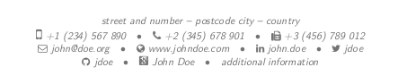

### Adding google scholar to ModernCV

Is quite easy to add the item google-scholar to the social section of the ModernCV.

1. Download the [pdf logo](google-scholar.pdf)

2. Add the following lines to the preamble:
 ```latex
 \newcommand*{\scholarsocialsymbol}{\includegraphics[height=.7\baselineskip]{google-scholar}}
 \collectionadd[scholar]{socials}{\href{https://scholar.google.com/citations?user=qc6CJjYAAAAJ&hl}{ John Doe}}
 ```
 and modify the link to redirect to your google scholar profile.
3. Compile


 For the casual style the output looks something like this:

 
